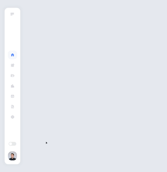
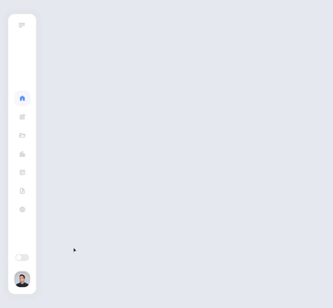
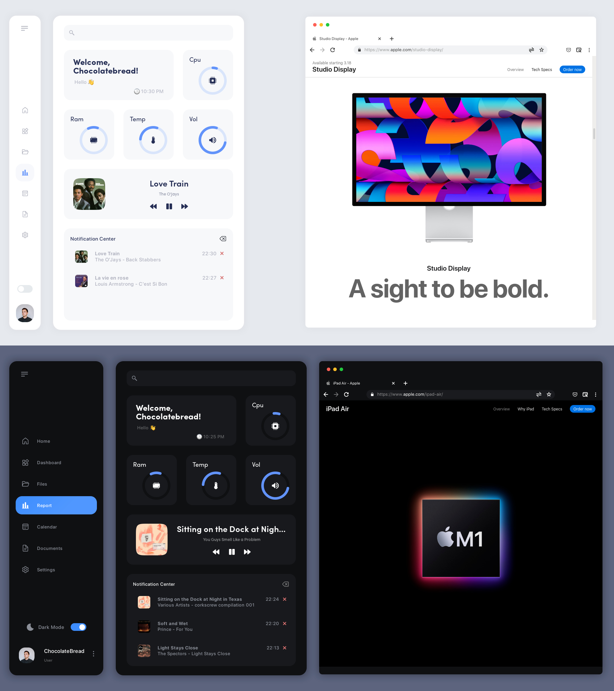

<div align=center>

<a href="https://awesomewm.org/"></a>

<div align="center">
    
    
</div>

</div>

<h2 align="center" style="font-weight: bold"> my awesomewm dotfiles </h2>

## __Welcome__
 to my dotfiles!
Here are some details about my setup

- [Awesomewm](https://awesomewm.org/)
- [Jonaburg Forked Picom](https://github.com/jonaburg/picom)
- [SF Pro Display](https://github.com/sahibjotsaggu/San-Francisco-Pro-Fonts)
- [SFMono Nerd Font](https://github.com/epk/SF-Mono-Nerd-Font)
- [Sofia Pro](https://fonts.adobe.com/fonts/sofia#fonts-section)
- [Wezterm](https://github.com/wez/wezterm)
- [Nemo](https://github.com/linuxmint/nemo)
- [Spotify](https://aur.archlinux.org/packages/spotify)
- [Chrome](https://aur.archlinux.org/packages/google-chrome)
- [Hilbish](https://github.com/Rosettea/Hilbish)

# Modules

## [Bling](https://blingcorp.github.io/bling/)
- Playerctl widget, layout 
## [Rubato](https://github.com/andOrlando/rubato)
- Create animation for aweosmeWM
## [Better resize](https://github.com/JavaCafe01/dotfiles/blob/master/config/awesome/module/better-resize.lua)
- An improved method of resizing clients in the tiled layout, and maded
by [javacafe01](https://github.com/JavaCafe01)

# Setup
1. install awesomewm

    **For arch users**
    ``` shell
    yay -S awesome-git
    ```
    **[For all users](https://github.com/awesomeWM/awesome/#building-and-installation)**

2. install softwares

    **For arch users**
    ```shell
    yay -S playerctl-git picom-jonaburg-git pavucontrol pulseaudio-ctl rofi wezterm hilbish x11-emoji-picker-git
    ```
    **For all users**
    - [playerctl](https://github.com/altdesktop/playerctl)
    - [picom-jonaburg](https://github.com/jonaburg/picom)
    - [pavucontrol](https://github.com/pulseaudio/pavucontrol)
    - [pulseaudio ctl](https://github.com/pulseaudio/pavucontrol)
    - [rofi](https://github.com/davatorium/rofi)
    - [wezterm](https://github.com/wez/wezterm)
    - [hilbish](https://github.com/Rosettea/Hilbish)
    - [emoji picker](https://github.com/GaZaTu/x11-emoji-picker)

3. install themes

    - [Icon theme](https://github.com/zayronxio/Mkos-Big-Sur)
    - [Cursor theme](https://github.com/varlesh/volantes-cursors)
    - [Gtk theme](https://github.com/vinceliuice/WhiteSur-gtk-theme)

4. install fonts

    - [SF Pro Display](https://github.com/sahibjotsaggu/San-Francisco-Pro-Fonts)
    - [SFMono Nerd Font](https://github.com/epk/SF-Mono-Nerd-Font)
    - [Sofia Pro](https://fonts.adobe.com/fonts/sofia#fonts-section)

5. install my dotfiles
    ```shell
    git clone --recurse-submodules https://github.com/ChocolateBread799/dotfiles
    cd dotfiles
    mv config/* ~/.config/
    ```

6. add spicetify colorschemes(optional)
    1. install [spicetify-cli](https://github.com/spicetify/spicetify-cli) and [themes](https://github.com/spicetify/spicetify-themes)
        ```shell
        yay -S spicetify-cli-git spicetify-themes-git

        sudo chmod a+wr /opt/spotify
        sudo chmod a+wr /opt/spotify/Apps -R    
        ```
    2. add colorschemes
        ```shell
        sudo cp color.ini ~/usr/share/spicetify/Themes/Ziro

        spicetify config current_theme Ziro
        ```

# Keyboard

_superkey is window key_

| Keybind | Action |
| --- | --- |
| <kbd>super + enter</kbd> | Spawn Terminal | 
| <kbd>super + q</kbd> | Spawn Vscode 
| <kbd>super + w</kbd> | Spawn Chrome |
| <kbd>super + e</kbd> | Spawn Spotify |
| <kbd>super + z</kbd> <kbd>wheel</kbd> | Spawn Sidebar |
| <kbd>super + x</kbd> | Change Colorscheme(Dark, White) |
| <kbd>super + d</kbd> | Spawn Emoji Picker |
| <kbd>PrtSc</kbd> | Screenshot |
| <kbd>super + PrtSc</kbd> | ScreenRec |


## Gallery





## Rices

- [first rice](https://github.com/ChocolateBread799/dotfiles/tree/1e9beb02c420bdff45d0f5e2a774e469d11c3885)
- [macindows](https://github.com/ChocolateBread799/dotfiles/tree/099a9a63fa4d3a105ed1e3254d31ca3264c413d7)
- [sweetness](https://github.com/ChocolateBread799/dotfiles/tree/a5cffc6580dc99e48c25958d51546642f0fe32d8)
- [doodle](https://github.com/ChocolateBread799/dotfiles/tree/5017bcf594ca02519a53e33e9ca76e6d5677034b)
- [another rice is coming..](https://www.youtube.com/watch?v=Tx5nF3Gay0A&ab_channel=ispoal)

## Special Thanks
- [JavaCafe01's Dotflies](https://github.com/JavaCafe01/dotfiles)
- [Elenapan's Dotfiles](https://github.com/elenapan/dotfiles)
- [Rayhan's](https://github.com/rxyhn) [Dotfiles](https://github.com/rxyhn/AwesomeWM-Dotfiles)
