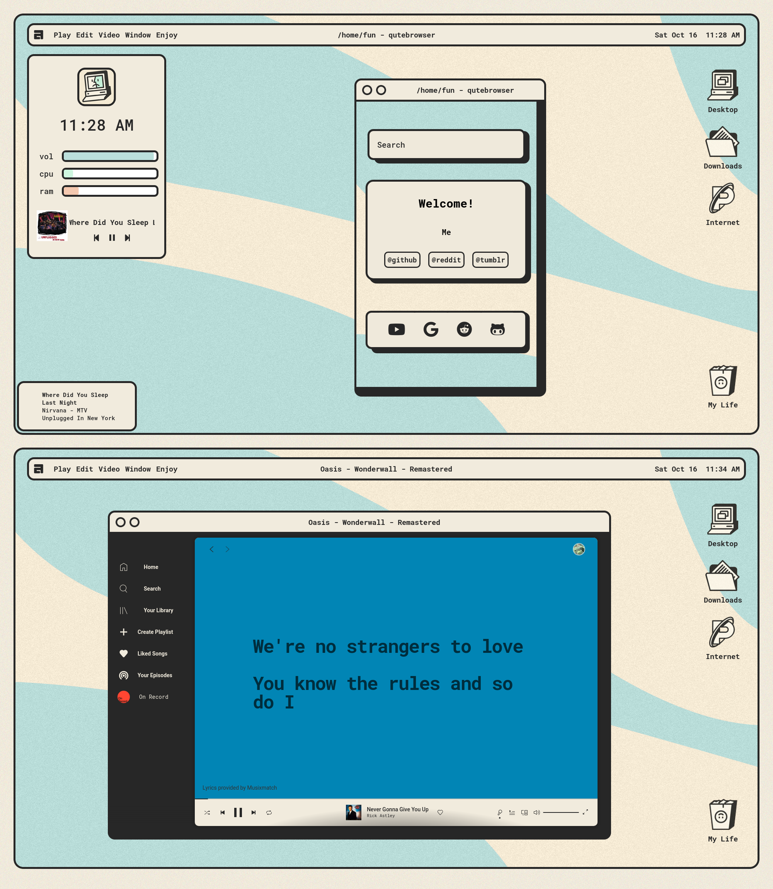

# ✨**My Awesomewm Dotfile**✨

thanks for [javacafe01](https://github.com/JavaCafe01)

# **Required**
- [Rofi](https://github.com/davatorium/rofi)
- [wezterm](https://wezfurlong.org/wezterm/)
- [Ibhagwan Forked Picom](https://github.com/ibhagwan/picom)
- [Roboto Mono](https://fonts.google.com/specimen/Roboto+Mono)

# **Module**

- [Bling](https://blingcorp.github.io/bling/)

## **Screenshot**

